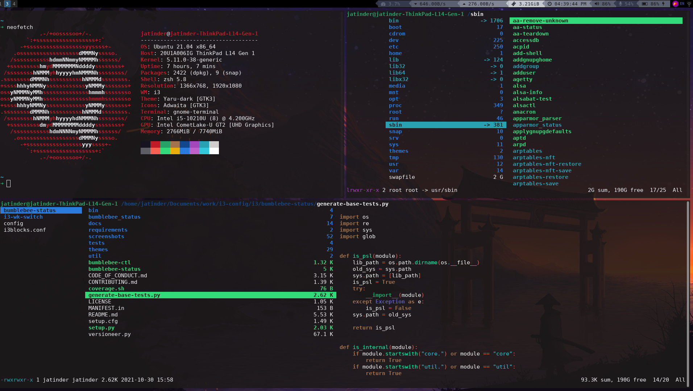

# i3wm - A tiling window manager

This is my configuration for i3wm a tiling window manager.
In this configuration I am using [Switches workspaces](https://github.com/tmfink/i3-wk-switch), this script switches workspaces in the i3 window manager and sway like xmonad.
[Bumblebee-status](https://github.com/tobi-wan-kenobi/bumblebee-status) bar is used in this.
The description of the different files are given below.

## ScreenShot

## Requirements
- [feh](https://github.com/derf/feh) to set the desktop background.
- [bumblebee-status](https://github.com/tobi-wan-kenobi/bumblebee-status) for the status bar.
- [rofi](https://github.com/davatorium/rofi) as an app launcher and clipboard manager.
- [dunst](https://github.com/dunst-project/dunst) to display notifications.
- [Compton](https://github.com/chjj/compton) a lightweight compositor for X.
